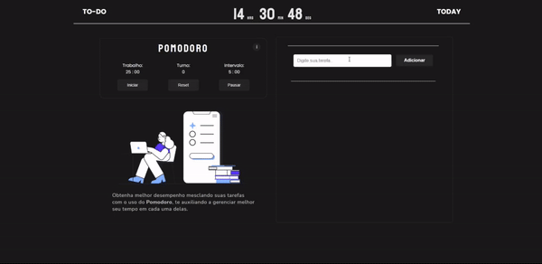

<h1 align="center">To-do Today</h1>

Lista de tarefas com as principais funcionalidades para auxiliar em atividades acadêmicas, ideal para estudantes.

 
  
## Demonstração da aplicação

Simples e funcional, nosso To-do traz as principais características para gerenciar suas atividades de estudos ou trabalho. 
<a href="https://guilhermewilker.github.io/ToDo-Today/" target="_blank">🔗Clique aqui e use agora mesmo!</a>

## Roadmap

- ⏳Gerenciamento de tempo em atividades de estudo.
- 📚Melhorar produtividade do usuário.
- 🖥️Design limpo, sem poluição visual.

## Funcionalidades

- 🕢Horário em tempo real
- 🖥️Modo tela cheia
- ⏳Timer Pomodoro
- 📃Listagem de tarefas

## Tecnologias utilizadas

## Social medias 🖥️

